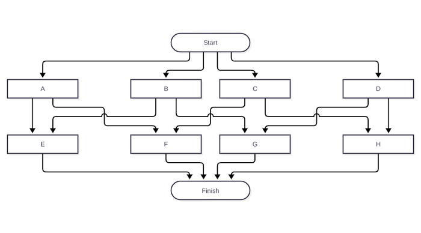
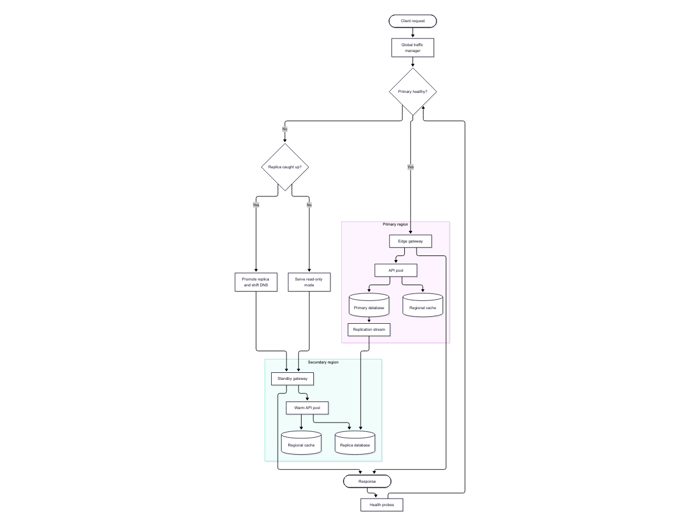
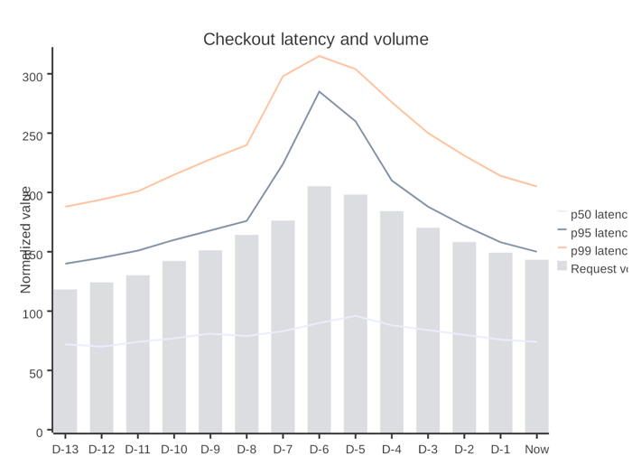
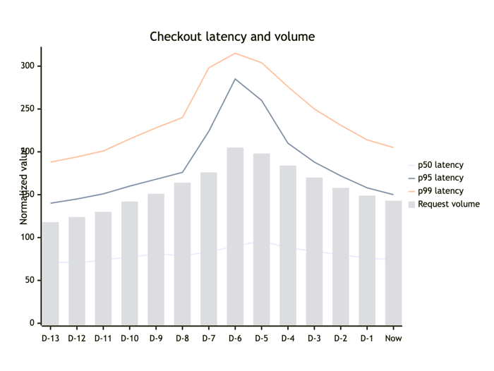
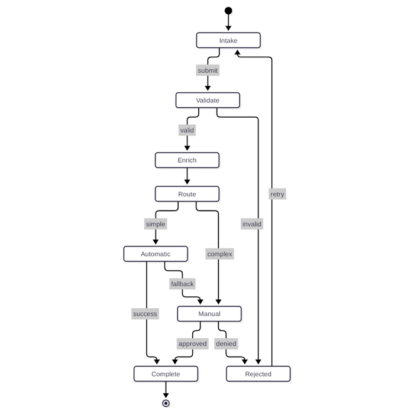
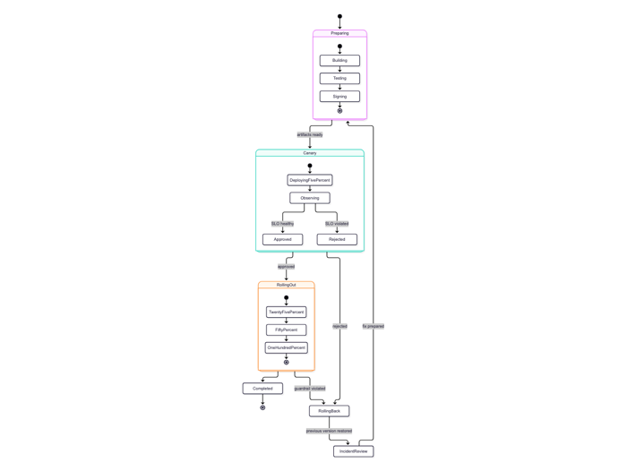
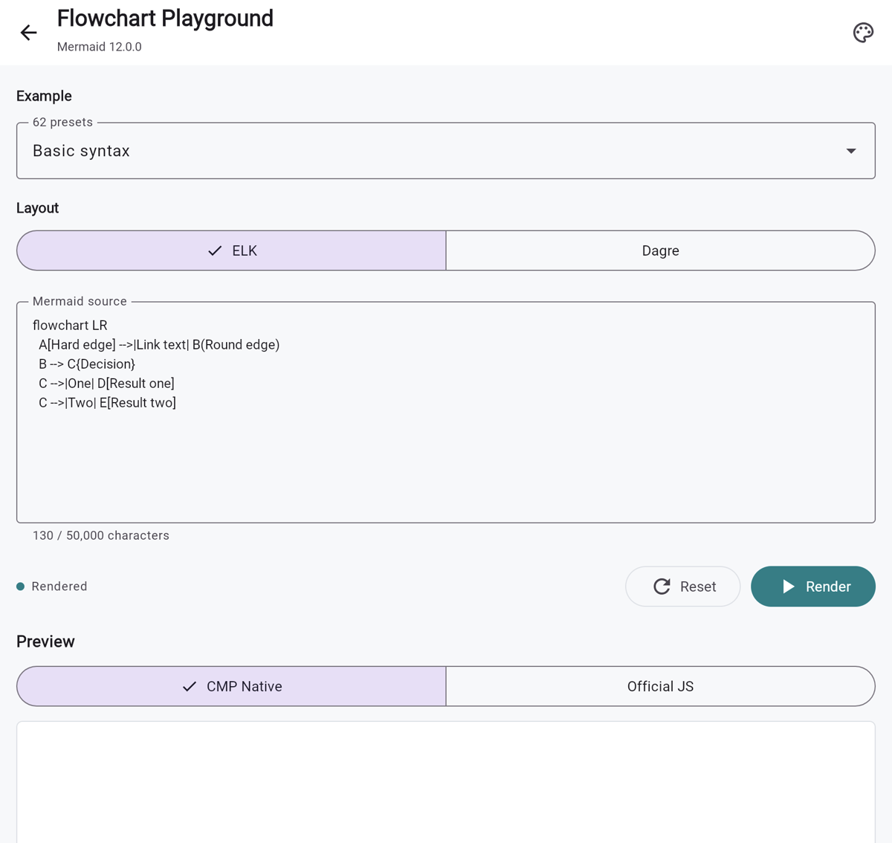

<div align="center">
  <h1>CMP Mermaid</h1>
  <p><strong>English</strong> · <a href="README.zh-CN.md">简体中文</a></p>
  <p><strong>Native Mermaid rendering for Kotlin and Compose Multiplatform.</strong></p>
  <p>Mermaid <code>12.0.0</code> semantics translated to Kotlin and rendered with Compose Canvas.</p>
  <p>
    <a href="https://github.com/swithun-liu/cmp-mermaid/actions/workflows/quality.yml">
      
    </a>
    <a href="https://github.com/swithun-liu/cmp-mermaid/actions/workflows/deploy-pages.yml">
      
    </a>
    <a href="https://mermaid.js.org/">
      
    </a>
    <a href="LICENSE">
      
    </a>
  </p>
  <p>
    <a href="https://swithun-liu.github.io/cmp-mermaid/"><strong>Live Web demo</strong></a>
    ·
    <a href="docs/assets/stability-report/visual-parity-evidence.md"><strong>7,680-case visual report</strong></a>
    ·
    <a href="docs/stability-report.md">Full Stable report</a>
    ·
    <a href="docs/full-diagram-roadmap.md">33-diagram roadmap</a>
    ·
    <a href="#integration">Integration</a>
  </p>
</div>

> [!IMPORTANT]
> **CMP Mermaid currently implements 30 of Mermaid `12.0.0`'s 33 official
> diagram families.** The remaining 3 families are on the
> **[full-diagram roadmap](docs/full-diagram-roadmap.md)**.
>
> The current **[7,680-case Native/Official visual report](docs/assets/stability-report/visual-parity-evidence.md)**
> covers all 30 implemented families. Flowchart, XY Chart, Quadrant Chart,
> Timeline, Kanban, Sequence, Class, State, Entity Relationship, Gantt, Pie,
> User Journey, Requirement, Git Graph, Mindmap, Packet, Radar, Sankey,
> Treemap, Venn, Ishikawa, Cynefin, Event Modeling, Agentflow, Block,
> Swimlanes, Architecture, C4, Railroad, and TreeView have completed the replacement
> 256-case detail gate. The report does not prove complete Mermaid
> compatibility because 3 official families remain
> untranslated.

CMP Mermaid is designed for applications that render many diagrams without a
WebView per diagram. The production path does not embed Mermaid.js and does not
include a network client or require `android.permission.INTERNET`: parsing,
diagram state, layout preparation, SceneGraph generation, and final Compose
Canvas painting are owned by the multiplatform libraries.

## Current Verification

The 30 implemented families retain repository-controlled tests and captures.
Flowchart, XY Chart, Quadrant Chart, Timeline, Kanban, Sequence, Class, State,
Entity Relationship, Gantt, Pie, User Journey, Requirement, Git Graph,
Mindmap, Packet, Radar, Sankey, Treemap, Venn, Ishikawa, Cynefin, Event Modeling,
Agentflow, Block, Swimlanes, Architecture, C4, Railroad, and TreeView pass the
replacement detail gate.

| Evidence | Result |
| --- | ---: |
| Official Mermaid diagram families | 33 |
| Implemented diagram families | 30/33 |
| Translation pending | 3 |
| Independent production scenarios | 397 |
| Declared capability coverage | 644/644 |
| Large-scale visual matrix | 7,680 unique sources: 256 per implemented family |
| Native/Official captures | 15,360 matrix screenshots plus 794 independent-corpus screenshots |
| Matrix detail review | All 30 implemented families: 7,680/7,680 accepted; 6,874 automatic passes plus 806 manually accepted ER/Journey/Requirement/Git Graph/Mindmap/Treemap/Venn/Event Modeling/Block/Swimlanes reviews |
| Automated visual geometry | 7,680/7,680 passed; all 30 implemented-family detail gates passed |
| Deterministic SceneGraph replay | 397 passed, 0 mismatches |
| Built-in theme matrix | 330/330 |
| Separate generated Native stress inputs | 7,680 |
| JVM tests | 707 passed, 0 failed |
| Core production soak | 1,985 renders, 779ms total, 1ms P95, 62,304 bytes retained heap |
| Runtime load matrix | Web passed the current 397-scenario corpus; Android, iOS, and Desktop retain the prior 236-scenario baseline |

| Evidence document | What it contains |
| --- | --- |
| **[Full diagram roadmap](docs/full-diagram-roadmap.md)** | Official 33-family inventory, current 30/33 state, missing 3 families, and the new Stable gate |
| **[Stable test report](docs/stability-report.md)** | Decision, visual contact sheets, tests, soak metrics, runtime load evidence, and reproduction steps |
| **[All 7,680 Native/Official pairs](docs/assets/stability-report/visual-parity-evidence.md)** | 480 paged contact sheets, with 16 same-source pairs per page |
| [Production capability matrix](docs/production-capability-matrix.md) | The 644 independently exercised capabilities |
| [Production readiness](docs/production-readiness.md) | Code-level Stable criteria, resource budgets, and integration guidance |
| [Quality Gate](https://github.com/swithun-liu/cmp-mermaid/actions/workflows/quality.yml) | Current automated JVM, build, publication, security, APK, visual, and Web load results |
| [Full Visual Parity](https://github.com/swithun-liu/cmp-mermaid/actions/workflows/full-visual-parity.yml) | Weekly/manual capture and detail enforcement for the implemented subset |

Overall Mermaid `12.0.0` support is not Stable until all 33 family gates pass.
A legal feature that cannot be represented faithfully returns
`MermaidError.UnsupportedFeature` instead of silently drawing a misleading
approximation.

## Native Vs Mermaid.js

The comparisons below use the same Mermaid source, theme, layout mode, and
fixed viewport. The goal is equivalent meaning and comparable visual quality,
not pixel-identical browser output; platform font metrics may differ.

**Flowchart: multi-region failover**

| CMP Native - Compose Canvas | Official - Mermaid.js `12.0.0` |
| :---: | :---: |
|  |  |

<details>
<summary><strong>More same-source comparisons</strong></summary>

**XY Chart: mixed bar and line series**

| CMP Native - Compose Canvas | Official - Mermaid.js `12.0.0` |
| :---: | :---: |
|  |  |

**State Diagram: labels, loops, branches, and terminal states**

| CMP Native - Compose Canvas | Official - Mermaid.js `12.0.0` |
| :---: | :---: |
|  |  |

The report contains the 397 independent production comparisons and a separate
large-scale matrix with 7,680 unique Mermaid sources:
**[open all 480 visual evidence pages](docs/assets/stability-report/visual-parity-evidence.md)**.

</details>

## Supported Diagrams

| Diagram | Status | Production cases | Main coverage | Details |
| --- | :---: | ---: | --- | --- |
| Flowchart | Detail gate passed | 14 | Jison/FlowDB, Dagre, shapes, links, Markdown/HTML labels | [Compatibility](docs/flowchart-compatibility.md) |
| XY Chart | Detail gate passed | 13 | Jison/XY DB, D3 scales and ticks, bar/line plots, labels | [Compatibility](docs/xychart-compatibility.md) |
| Quadrant Chart | Detail gate passed | 13 | Axes, quadrants, points, classes, direct styles, themes | [Compatibility](docs/quadrant-compatibility.md) |
| Timeline | Detail gate passed | 13 | LR/TD layouts, sections, periods, events, color scales, themes | [Compatibility](docs/timeline-compatibility.md) |
| Kanban | Detail gate passed | 13 | Sections, tasks, metadata, priorities, ticket links, themes | [Compatibility](docs/kanban-compatibility.md) |
| Sequence | Detail gate passed | 14 | Actors, 26 message forms, notes, activations, control regions | [Compatibility](docs/sequence-compatibility.md) |
| Class | Detail gate passed | 13 | Compartments, generics, namespaces, relations, Dagre | [Compatibility](docs/class-compatibility.md) |
| State | Detail gate passed | 13 | Composite states, concurrency, notes, forks/joins, Dagre | [Compatibility](docs/state-compatibility.md) |
| Entity Relationship | Detail gate passed | 13 | Attributes, cardinalities, relationships, nested subgraphs | [Compatibility](docs/er-compatibility.md) |
| Gantt | Detail gate passed | 13 | Dates, dependencies, exclusions, milestones, D3-style ticks | [Compatibility](docs/gantt-compatibility.md) |
| Pie | Detail gate passed | 13 | Langium grammar, D3 angles, donut, legends, palettes | [Compatibility](docs/pie-compatibility.md) |
| User Journey | Detail gate passed | 13 | Sections, scores, actors, satisfaction faces, text strategies | [Compatibility](docs/journey-compatibility.md) |
| Requirement | Detail gate passed | 13 | SysML types and fields, elements, seven relationships, Dagre, styling | [Compatibility](docs/requirement-compatibility.md) |
| Git Graph | Detail gate passed | 13 | Langium grammar, branches, merges, cherry-picks, orientations, themes | [Compatibility](docs/gitgraph-compatibility.md) |
| Mindmap | Detail gate passed | 13 | Jison/Mindmap DB, CoSE-Bilkent, Dagre, tidy tree, shapes, themes | [Compatibility](docs/mindmap-compatibility.md) |
| Packet | Detail gate passed | 13 | Langium grammar, explicit and counted fields, row splitting, fixed-grid rendering | [Compatibility](docs/packet-compatibility.md) |
| Radar | Detail gate passed | 13 | Langium grammar, axes, curves, graticules, legends, themes | [Compatibility](docs/radar-compatibility.md) |
| Sankey | Detail gate passed | 13 | CSV grammar, D3 Sankey layout, alignments, value labels, link and node colors | [Compatibility](docs/sankey-compatibility.md) |
| Treemap | Detail gate passed | 13 | Langium grammar, D3 hierarchy and squarify layout, classes, values, responsive sizing | [Compatibility](docs/treemap-compatibility.md) |
| Venn | Detail gate passed | 13 | Jison grammar, Venn.js/fmin optimization, weighted overlaps, styles, text nodes | [Compatibility](docs/venn-compatibility.md) |
| Ishikawa | Detail gate passed | 13 | Jison indentation grammar, alternating recursive branches, fish-head geometry, wrapping | [Compatibility](docs/ishikawa-compatibility.md) |
| Cynefin | Detail gate passed | 13 | Five domains, deterministic boundaries, confusion overflow, transitions, themes | [Compatibility](docs/cynefin-compatibility.md) |
| Event Modeling | Detail gate passed | 13 | Langium grammar, frames, swimlanes, data, relations, validation, themes | [Compatibility](docs/eventmodeling-compatibility.md) |
| Agentflow | Detail gate passed | 13 | Jison grammar, typed nodes and edges, nested/global/collapsed flows, connectors, metadata, Dagre | [Compatibility](docs/agentflow-compatibility.md) |
| Block | Detail gate passed | 13 | Jison grammar, grids, spans, composites, shapes, block arrows, links, classes, styles | [Compatibility](docs/block-compatibility.md) |
| Swimlanes | Detail gate passed | 13 | Flowchart grammar and shapes, lane-aware Sugiyama layout, orthogonal routing, direction transforms | [Compatibility](docs/swimlanes-compatibility.md) |
| Architecture | Detail gate passed | 13 | Langium grammar, services, groups, junctions, directional edges, constrained fCoSE layout, icons | [Compatibility](docs/architecture-compatibility.md) |
| C4 | Detail gate passed | 13 | Five C4 levels, nested boundaries, deployment nodes, relation variants, styles, and configuration | [Compatibility](docs/c4-compatibility.md) |
| Railroad | Detail gate passed | 18 | Railroad IR, EBNF, ABNF, PEG, shared AST, routed grammar paths, styles, and configuration | [Compatibility](docs/railroad-compatibility.md) |
| TreeView | Detail gate passed | 13 | Indentation and box-drawing syntax, hierarchy, annotations, descriptions, icons, styles, and configuration | [Compatibility](docs/treeview-compatibility.md) |

All 30 implemented types support Mermaid frontmatter, relevant metadata, Unicode, and
the relevant theme variables within their documented compatibility boundaries.

## Try It

Open the **[live Kotlin/Wasm demo](https://swithun-liu.github.io/cmp-mermaid/)**
to browse syntax, render the galleries, switch all 11 themes, and compare CMP
Native output with the pinned Mermaid.js reference. Every supported diagram
type has an editable Playground with Native/Official preview switching.
Mindmap can switch among CoSE-Bilkent, Dagre, and tidy-tree layouts.

<a href="https://swithun-liu.github.io/cmp-mermaid/">
  
</a>

The official comparison renderer belongs to `mermaid-debug-ui` only.
`mermaid-core` and `mermaid-compose` never use Mermaid.js.

## Architecture

```text
Mermaid source
    -> Kotlin preprocessor and translated parser
    -> translated diagram database and layout preparation
    -> platform-independent MermaidScene
    -> Compose Canvas
```

- `mermaid-core` owns parsing, diagram state, layout adapters, typed errors,
  themes, and the platform-independent SceneGraph.
- `mermaid-compose` owns Canvas painting, text measurement, assets,
  interactions, and pan/zoom behavior.
- `mermaid-debug-ui` owns documentation, galleries, Playground, official
  comparison, and load-test screens. It is optional and should remain outside
  production release variants.
- `sample/*` contains thin Android, iOS, Desktop, and Web launchers around the
  shared debug UI.

The production libraries contain no JavaScript engine or bundled JavaScript
algorithm. Pure Kotlin Dagre is the default unified layout. ELK names and
`flowchart-elk` are recognized as upstream inputs but return
`MermaidError.UnsupportedFeature("ELK layout")`; they are never silently
substituted with another layout.

## Integration

The current publication coordinates are:

| Consumer | Artifact |
| --- | --- |
| Current Kotlin Multiplatform | `io.github.swithun-liu:mermaid-core:0.1.2` |
| Current Compose Multiplatform | `io.github.swithun-liu:mermaid-compose:0.1.2` |
| Android with Kotlin `1.7.21` | `io.github.swithun-liu:mermaid-core-android-kotlin17:0.1.2` |
| Android Compose with Kotlin `1.7.21` | `io.github.swithun-liu:mermaid-compose-android-kotlin17:0.1.2` |
| iOS binary | `CMPMermaid` CocoaPod `0.1.2` |

Current Kotlin Multiplatform projects:
```kotlin
dependencies {
    implementation("io.github.swithun-liu:mermaid-compose:0.1.2")
}
```

> [!NOTE]
> The Maven coordinates above are published and resolvable from the configured
> public repository. CocoaPods distribution remains a separate binary release
> path.

Android projects pinned to Kotlin `1.7.21` use the isolated Android artifact:

```kotlin
dependencies {
    implementation(
        "io.github.swithun-liu:mermaid-compose-android-kotlin17:0.1.2",
    )
}
```

The Kotlin `1.7.21` artifacts are Android-only, target JVM 1.8, and require
Android API 24 or newer. Their artifact names are intentionally distinct from
the current KMP modules, so a consumer cannot accidentally resolve Kotlin 2.x
metadata.

Android View-based hosts can use the same Compose renderer without compiling
Compose source:

```kotlin
val diagramView = CMPMermaidView(context).apply {
    setMermaidSource("flowchart LR\n  A --> B")
    setMermaidContentDescription("Example Mermaid diagram")
    setMermaidErrorListener { error ->
        reportRenderFailure(error.type, error.message, error.source)
    }
}
container.addView(diagramView)
```

`CMPMermaidView` is available from both the current Android target and the
Kotlin `1.7.21` Android artifact.

iOS projects can consume the precompiled static XCFramework through CocoaPods:

```ruby
pod 'CMPMermaid', '0.1.2'
```

The binary exposes `CMPMermaidViewControllerFactory.makeViewController(...)`
to Swift and includes all renderer font resources. It supports iOS device
arm64 and simulator arm64/x86_64 with a deployment target of iOS 14.

```swift
CMPMermaidViewControllerFactory().makeViewController(
    source: source,
    contentDescription: "Mermaid diagram",
    onContentSizeChanged: nil,
    onError: { error in
        reportRenderFailure(error.type, error.message, error.source)
    }
)
```

For a source checkout:

```kotlin
dependencies {
    implementation(project(":mermaid-compose"))
    debugImplementation(project(":mermaid-debug-ui"))
}
```

Basic Compose usage:

```kotlin
import androidx.compose.foundation.layout.fillMaxWidth
import androidx.compose.runtime.Composable
import androidx.compose.ui.Modifier
import com.swithun.cmpmermaid.compose.MermaidDiagram
import com.swithun.cmpmermaid.core.MermaidTheme
import com.swithun.cmpmermaid.core.MermaidThemePreset

@Composable
fun Diagram(source: String) {
    MermaidDiagram(
        source = source,
        modifier = Modifier.fillMaxWidth(),
        theme = MermaidTheme.preset(MermaidThemePreset.Default),
        contentDescription = "Mermaid diagram",
        onError = { error ->
            reportRenderFailure(error.type, error.message, error.source)
        },
    )
}
```

The error callback receives `MermaidRenderErrorInfo`, including the original
source passed to the renderer.
`CONTENT_ERROR` represents structured parse, configuration, resource-limit, or
unsupported-content failures. `UNEXPECTED_EXCEPTION` represents an ordinary
exception caught inside the render pipeline or Compose drawing boundary.
Coroutine cancellation and fatal process errors continue to propagate.

Generate all KMP publications under `build/maven-repository`:
```bash
./gradlew \
  :mermaid-core:publishAllPublicationsToBuildRepository \
  :mermaid-compose:publishAllPublicationsToBuildRepository
```

Generate the Kotlin `1.7.21` Android artifacts with JDK 11:

```bash
./android-legacy-build/gradlew -p android-legacy-build \
  assembleRelease \
  verifyLegacyPublicationCoordinates \
  publishLegacyToReleaseRepository
```

Generate and verify the static iOS binary with JDK 17:

```bash
./gradlew :mermaid-compose:podPublishReleaseXCFramework
tools/release/verify-ios-xcframework.sh
```

### Release automation

Pushing a `v*` tag runs the modern KMP, iOS XCFramework, and Kotlin `1.7.21`
Android builds in parallel. Their signed outputs are joined and verified before
any public registry is updated.

An interrupted publication keeps its prerelease and verified workflow artifact
for 14 days. Re-run the failed jobs, or manually run the `Release` workflow
with the same immutable tag. Maven Central and CocoaPods are checked before
each write, so an already-published version is verified and skipped instead of
being uploaded again.

## Themes

All 11 Mermaid `12.0.0` presets are included:
`default`, `dark`, `forest`, `neutral`, `base`, `neo`, `neo-dark`, `redux`,
`redux-color`, `redux-dark`, and `redux-dark-color`.

Business themes can start from a preset with Kotlin `copy`, or consume
Mermaid-compatible `themeVariables` through `MermaidTheme.withVariables(...)`.
Invalid external values are returned as `GMResult.Err`.

```kotlin
val brandTheme = MermaidTheme.preset(MermaidThemePreset.ReduxColor).copy(
    background = SceneColor(0xFF101820),
    nodeFill = SceneColor(0xFFF2AA4C),
    nodeText = SceneColor(0xFF101820),
    edge = SceneColor(0xFFF2AA4C),
)
```

Arbitrary `themeCSS` depends on browser DOM/CSS semantics and returns
`MermaidError.UnsupportedFeature`. Portable styling uses typed Kotlin theme
objects and `MermaidFontFamilyResolver`.

## Following Mermaid Releases

CMP Mermaid follows a source-mapped translation workflow rather than
reimplementing behavior from screenshots:

1. Pin Mermaid, Jison, D3, Marked, Dagre, CoSE-Bilkent, and tidy-tree versions.
2. Map every Kotlin parser, DB, layout, shape, theme, and renderer boundary to
   its upstream Mermaid source.
3. Generate parser tables, rules, entities, fixtures, and debug-only reference
   assets from pinned inputs.
4. Translate only the upstream delta for a Mermaid upgrade.
5. Re-run the complete parity and platform gates.

Source maps:
[Flowchart](docs/upstream-flowchart-map.md) ·
[XY Chart](docs/upstream-xychart-map.md) ·
[Quadrant Chart](docs/upstream-quadrant-map.md) ·
[Timeline](docs/upstream-timeline-map.md) ·
[Kanban](docs/upstream-kanban-map.md) ·
[Sequence](docs/upstream-sequence-map.md) ·
[Class](docs/upstream-class-map.md) ·
[State](docs/upstream-state-map.md) ·
[ER](docs/upstream-er-map.md) ·
[Gantt](docs/upstream-gantt-map.md) ·
[Pie](docs/upstream-pie-map.md) ·
[User Journey](docs/upstream-journey-map.md) ·
[Requirement](docs/upstream-requirement-map.md) ·
[Git Graph](docs/upstream-gitgraph-map.md) ·
[Mindmap](docs/upstream-mindmap-map.md) ·
[Packet](docs/upstream-packet-map.md) ·
[Radar](docs/upstream-radar-map.md) ·
[Sankey](docs/upstream-sankey-map.md) ·
[Treemap](docs/upstream-treemap-map.md) ·
[Venn](docs/upstream-venn-map.md) ·
[Ishikawa](docs/upstream-ishikawa-map.md) ·
[Cynefin](docs/upstream-cynefin-map.md) ·
[Event Modeling](docs/upstream-eventmodeling-map.md) ·
[Agentflow](docs/upstream-agentflow-map.md) ·
[Block](docs/upstream-block-map.md)

## Verification

Run the JVM and publication gates:

```bash
./gradlew \
  :mermaid-core:jvmTest \
  :mermaid-compose:jvmTest \
  verifyPublicationCoordinates
```

Run the samples:

```bash
./gradlew :sample:androidApp:installDebug
./gradlew :sample:desktopApp:run
./gradlew :sample:webApp:wasmJsBrowserDevelopmentRun
```

The **[Stable test report](docs/stability-report.md#reproduce-the-report)**
contains the complete cross-platform build and Native/Official visual
reproduction commands.

## License

CMP Mermaid is released under the [MIT License](LICENSE).
Translated Mermaid behavior and development-only reference assets retain their
upstream notices in [THIRD_PARTY_NOTICES.md](THIRD_PARTY_NOTICES.md).
