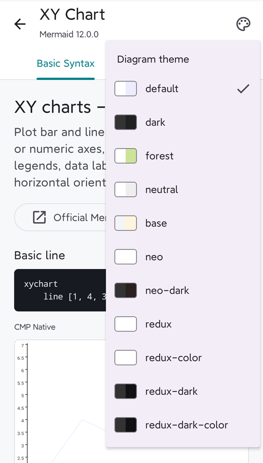

<div align="center">
  <h1>CMP Mermaid</h1>
  <p><strong>Native Mermaid rendering for Kotlin Multiplatform and Compose Multiplatform.</strong></p>
  <p>Mermaid <code>12.0.0</code> semantics translated to Kotlin, rendered with Compose Canvas.</p>
  <p>
    <a href="https://swithun-liu.github.io/cmp-mermaid/"><strong>Open the live Web demo</strong></a>
    ·
    <a href="#release-candidate-support-matrix">Support matrix</a>
    ·
    <a href="#why-it-can-follow-mermaid-releases">Upgrade model</a>
    ·
    <a href="#integration">Integration</a>
  </p>
</div>

> **Current baseline:** Mermaid `12.0.0` · **Release candidates:** 8 ·
> **Built-in themes:** 11 · **Platforms:** Android, iOS, Desktop, Web ·
> **Independent complex scenarios:** 42 · **JVM tests:** 270
>
> Evidence and current limitations:
> **[Mermaid 12.0.0 Release Candidate test report](docs/stability-report.md)**

CMP Mermaid is built for screens that may contain many diagrams. Production
rendering does not create a WebView and does not execute Mermaid.js. Parsing,
diagram databases, layout preparation, shapes, edges, markers, text handling,
themes, and SceneGraph conversion live in Kotlin, with the final output painted
by Compose Canvas.

## Native Vs Mermaid.js 12.0.0

These images come from the independent Release Candidate corpus, not the demo
gallery. They use the **same Mermaid source, theme, layout mode, and fixed
viewport**. The target is semantic and visual parity, not a pixel-for-pixel
browser clone; small font-metric differences are expected across platforms.

**Flowchart: multi-region failover**

| CMP Native - Compose Canvas | Official - Mermaid.js `12.0.0` |
| :---: | :---: |
|  |  |

The Native renderer preserves regional grouping, failover branches, data
replication, edge routing, and terminal outcomes without embedding the
official SVG renderer.

<details>
<summary><strong>More same-source parity examples</strong></summary>

**XY Chart: mixed bar/line series and legend**

| CMP Native - Compose Canvas | Official - Mermaid.js `12.0.0` |
| :---: | :---: |
|  |  |

**State Diagram: labels, loops, branches, and terminal states**

| CMP Native - Compose Canvas | Official - Mermaid.js `12.0.0` |
| :---: | :---: |
|  |  |

</details>

## Try It Online

Open <https://swithun-liu.github.io/cmp-mermaid/> to:

- browse syntax and curated galleries for all eight release-candidate diagram types;
- switch between CMP Native and on-demand Mermaid.js `12.0.0` references;
- edit Flowchart source in the Playground and compare ELK with Dagre;
- switch all 11 Mermaid `12.0.0` themes from the palette menu.

| Live Kotlin/Wasm Playground | Shared 11-theme picker |
| :---: | :---: |
| <a href="https://swithun-liu.github.io/cmp-mermaid/"></a> |  |

The Web demo is the shared Compose Multiplatform UI running on Kotlin/Wasm.
The first visit downloads and compiles the renderer; browser caching makes
later visits faster.

## Release Candidate Support Matrix

| Diagram | Demo examples | Independent RC cases | Major translated coverage | Status |
| --- | ---: | ---: | --- | :---: |
| Flowchart | 62 | 6 | Jison/FlowDB, Dagre, ELK adapter, shapes, links, Markdown/HTML labels | Release candidate |
| XY Chart | 32 | 5 | Jison/XY DB, D3 scales/ticks, chartBuilder, bar/line plots | Release candidate |
| Sequence | 35 | 6 | Jison/Sequence DB, actors, 26 message forms, notes, control regions | Release candidate |
| Class | 27 | 5 | Jison/Class DB, compartments, namespaces, relations, ELK/Dagre | Release candidate |
| State | 25 | 5 | Jison/State DB, composites, concurrency, notes, ELK/Dagre | Release candidate |
| Entity Relationship | 20 | 5 | Jison/ER DB, attributes, cardinalities, subgraphs, ELK/Dagre | Release candidate |
| Gantt | 20 | 5 | Jison/Gantt DB, dates, dependencies, exclusions, milestones, ticks | Release candidate |
| Pie | 20 | 5 | Langium grammar, Pie DB, D3 angles, donut, legends, palettes | Release candidate |

Demo examples are for feature discovery and are not counted as stability
evidence. Each release candidate is separately covered by official
documentation fixtures, deterministic stress tests, the independent complex
corpus, and Native/Official screenshots.
Unsupported legal Mermaid features return
`MermaidError.UnsupportedFeature` instead of silently drawing a misleading
approximation.

## Platforms And Runtime

| Platform | Production rendering | Official comparison |
| --- | --- | --- |
| Android | Compose Canvas | Debug-only local WebView |
| iOS | Compose Canvas | Native renderer only |
| Desktop | Compose Canvas | Native renderer only |
| Web | Compose Canvas on Kotlin/Wasm | Debug-only local Mermaid.js iframe |

`mermaid-core` and `mermaid-compose` do not declare
`android.permission.INTERNET`. The official Mermaid.js asset and comparison UI
belong to the optional `mermaid-debug-ui` module, not the production renderer.

ELK layout uses a Kotlin-translated Mermaid adapter around a locked
`elkjs@0.9.3` worker. Android and Desktop execute it in isolated QuickJS, iOS
uses the system JavaScriptCore runtime, and Web uses the browser runtime.
Mermaid.js itself is never used by the production renderer.

## Themes

The renderer includes all 11 Mermaid `12.0.0` presets:
`default`, `dark`, `forest`, `neutral`, `base`, `neo`, `neo-dark`, `redux`,
`redux-color`, `redux-dark`, and `redux-dark-color`.

```kotlin
MermaidDiagram(
    source = source,
    theme = MermaidTheme.preset(MermaidThemePreset.Forest),
)
```

Business themes can start from a preset with Kotlin `copy`, or consume
Mermaid-compatible `themeVariables` through
`MermaidTheme.withVariables(...)`. Invalid remote values are returned as
`GMResult.Err`.

```kotlin
val brandTheme = MermaidTheme.preset(MermaidThemePreset.ReduxColor).copy(
    background = SceneColor(0xFF101820),
    nodeFill = SceneColor(0xFFF2AA4C),
    nodeText = SceneColor(0xFF101820),
    edge = SceneColor(0xFFF2AA4C),
)
```

Frontmatter `theme` and `themeVariables` remain compatible with Mermaid.js.
Arbitrary `themeCSS` depends on a browser DOM and therefore returns
`MermaidError.UnsupportedFeature`; portable styling uses the typed Kotlin
theme objects or a custom `MermaidFontFamilyResolver`.

## Why It Can Follow Mermaid Releases

This project is not maintained by visually guessing at official output. It
uses a source-mapped translation workflow:

1. **Freeze a baseline.** Mermaid, Jison, D3, Marked, Dagre, and ELK versions
   and relevant upstream SHA-256 values are recorded.
2. **Map upstream ownership.** Each Kotlin parser, DB, layout, shape, edge,
   theme, and renderer module names the Mermaid source file it translates.
3. **Generate deterministic artifacts.** Jison tables, regex rules, HTML
   entities, fixtures, and the ELK worker are regenerated from pinned inputs.
4. **Translate only the upstream delta.** A Mermaid upgrade starts with diffs
   of mapped files, then ports changed behavior inside the same Kotlin
   boundaries.
5. **Re-run parity gates.** JVM tests, deterministic random tests, every
   platform compile, official documentation fixtures, and complete
   Native/Official screenshot galleries must pass before a renderer is marked
   stable.

Following a new Mermaid release is therefore **incremental and reviewable, not
automatic**. If Mermaid changes a grammar production, DB method, shape, layout
stage, or theme variable, the matching Kotlin boundary and its parity tests
identify where the update belongs.

Source maps:
[Flowchart](docs/upstream-flowchart-map.md) ·
[XY Chart](docs/upstream-xychart-map.md) ·
[Sequence](docs/upstream-sequence-map.md) ·
[Class](docs/upstream-class-map.md) ·
[State](docs/upstream-state-map.md) ·
[ER](docs/upstream-er-map.md) ·
[Gantt](docs/upstream-gantt-map.md) ·
[Pie](docs/upstream-pie-map.md)

```text
Mermaid source
    -> Kotlin preprocessor + translated parser/runtime + diagram DB
    -> translated Dagre/D3/rendering logic or Kotlin ELK adapter
    -> platform-independent SceneGraph
    -> Compose Canvas
```

## Integration

Until the first published artifact release, consume the repository modules:

```kotlin
dependencies {
    implementation(project(":mermaid-compose"))
    debugImplementation(project(":mermaid-debug-ui"))
}
```

The planned artifact split keeps the comparison UI out of production builds:

```kotlin
implementation("io.github.cmpmermaid:mermaid-compose:<version>")
debugImplementation("io.github.cmpmermaid:mermaid-debug-ui:<version>")
```

Basic Compose usage:

```kotlin
MermaidDiagram(
    source = """
        flowchart LR
          Parse --> Layout --> SceneGraph --> Canvas
    """.trimIndent(),
    modifier = Modifier.fillMaxWidth(),
)
```

## Modules

- `mermaid-core`: common Kotlin diagram semantics, layout adapters, typed
  errors, and platform-independent SceneGraph.
- `mermaid-compose`: Compose Canvas painting, typography, assets,
  interactions, and bounded pan/zoom.
- `mermaid-debug-ui`: optional shared docs, galleries, Playground, themes, and
  Native/Official comparison UI.
- `sample/androidApp`, `sample/iosApp`, `sample/desktopApp`, `sample/webApp`:
  thin platform launchers around the shared debug UI.
- `tools/official-reference`: reproducible Mermaid.js references and source
  generation tools; development-only, never part of the native runtime.

## Detailed Compatibility

## Flowchart Coverage

The supported path includes:

- `flowchart`, `flowchart-elk`, and `graph`, with all documented directions.
- Mermaid `flow.jison` grammar and FlowDB behavior, including chained and
  multi-node links.
- Classic and metadata node shapes, nested subgraphs, cross-hierarchy edges,
  classes, inline styles, frontmatter, directives, and themes.
- Dagre and Mermaid's ELK algorithms/options, including `arc`, `gap`, and
  disabled ELK crossing line hops.
- Solid, dotted, thick, invisible, animated, bidirectional, circle, and cross
  links, edge ids, labels, and minimum lengths.
- Marked `16.4.2` label tokenization, HTML formatting spans, HTML entities,
  sanitization, and Mermaid HTML/SVG line-height behavior.
- Android bitmap/SVG image nodes from `data:` sources by default, with
  explicitly enabled HTTP/HTTPS loading and intrinsic-size layout feedback.
- Native links, tooltips, and callbacks through `SceneNodeInteraction`, with
  Mermaid security-level behavior.

Features that cannot yet be represented correctly return
`MermaidError.UnsupportedFeature` instead of rendering a misleading
approximation. The main boundaries are KaTeX, FontAwesome/Iconify label
replacement, inline HTML image/link/SVG/MathML content, `handDrawn`,
`themeCSS`, `altFontFamily`, and unsupported CSS properties. See
[`docs/flowchart-compatibility.md`](docs/flowchart-compatibility.md) for the
full matrix.

## XY Chart Coverage

The supported path includes:

- Mermaid's generated `xychart.jison` grammar and translated `xychartDb.ts`
  state and automatic-domain semantics.
- Vertical and horizontal charts with categorical or numeric axes, negative
  and decimal values, axis titles, labels, ticks, lines, and rotations.
- Multiple bar and line series, declaration-order palettes, named-series
  legends, overlapping bars, and mismatched series lengths.
- Bar labels inside or outside bars and per-point labels on line series.
- Mermaid's translated `chartBuilder` space allocation, D3 linear/band
  scales, D3 tick selection, dimensions, visibility flags, and plot-space
  configuration.
- XY theme variables and palettes across all built-in Mermaid themes.

Browser CSS overrides return `MermaidError.UnsupportedFeature`; SVG-only
responsive sizing is owned by the Compose host. See
[`docs/xychart-compatibility.md`](docs/xychart-compatibility.md) for the full
matrix.

## Sequence Coverage

The supported path includes:

- Mermaid's generated `sequenceDiagram.jison` grammar and translated
  `sequenceDb.ts` state semantics.
- Participants, actors, Mermaid 12 participant types, aliases, boxes,
  create/destroy lifecycle, and top/bottom actor bands.
- All 26 Sequence message forms, including open, filled, cross,
  bidirectional, async, half, stick, dotted, and central-connection markers.
- Activations, self messages, autonumber, side/over notes, explicit wrapping,
  HTML line breaks, Unicode text, title, and accessibility metadata.
- `loop`, `alt`, `opt`, `par`, `par_over`, `critical`, `break`, and `rect`
  control regions, including nesting.

Browser-only participant menus, properties, and DOM `details` references
return `MermaidError.UnsupportedFeature`. See
[`docs/sequence-compatibility.md`](docs/sequence-compatibility.md) for the
full matrix.

## Class Diagram Coverage

The supported path includes:

- Mermaid's generated `classDiagram.jison` grammar and translated
  `classDb.ts` state semantics.
- Classes, aliases, annotations, generic types, member/method compartments,
  visibility, and static/abstract classifiers.
- Association, aggregation, composition, extension, dependency, lollipop,
  reverse, bidirectional, dotted, solid, and self relations.
- Relation labels, marker-aware cardinalities, standalone/attached notes,
  nested/labelled/compact namespaces, and every documented direction.
- Mermaid's default ELK layout and explicit Dagre override.
- `style`, `classDef`, links, callbacks, tooltips, Markdown/HTML text, title,
  accessibility metadata, Unicode, and empty-compartment configuration.

KaTeX, browser-only label content, `handDrawn`, and unmapped CSS return
`MermaidError.UnsupportedFeature`. See
[`docs/class-compatibility.md`](docs/class-compatibility.md) for the full
matrix.

## State Diagram Coverage

The supported path includes:

- Mermaid's generated `stateDiagram.jison` grammar, translated `stateDb.ts`
  document semantics, and translated `dataFetcher.ts` renderer projection.
- States, aliases, repeated descriptions, transitions, labels, self-loops,
  root/nested start and end markers, choice, fork, and join pseudostates.
- Named, nested, and sibling composite states, concurrency regions, and
  root/nested TB, BT, LR, and RL directions.
- Single-line and multiline folded notes with Mermaid's directed dashed-edge
  placement semantics.
- Mermaid's default ELK layout, named ELK algorithms, and explicit Dagre
  override.
- `style`, `classDef`, `class`, inline `:::`, links, tooltips, Markdown/HTML
  text, title, accessibility metadata, Unicode, and State layout configuration.

KaTeX, browser-only label content, `handDrawn`, unmapped CSS, and unconnected
layout engines return `MermaidError.UnsupportedFeature`. See
[`docs/state-compatibility.md`](docs/state-compatibility.md) for the full
matrix.

## Entity Relationship Diagram Coverage

The supported path includes:

- Mermaid's generated `erDiagram.jison` grammar and translated `erDb.ts`
  entity, attribute, relationship, style, subgraph, and metadata semantics.
- Aliases, Unicode names, nullable and generic attribute types, comments, and
  `PK`, `FK`, and `UK` key combinations.
- All four visible crow-foot cardinalities, identifying and non-identifying
  relationships, self-relationships, repeated relationships, and labels.
- Root and nested subgraphs, subgraph relationships, and TB, BT, LR, and RL
  directions.
- Mermaid's default ELK layout, named ELK algorithms, and explicit Dagre
  override.
- `style`, `classDef`, `class`, inline `:::`, Markdown/HTML text, title,
  accessibility metadata, Unicode, and ER layout configuration.

The `MD_PARENT` token is parsed but has no marker, matching Mermaid 12's
unified renderer, which does not register the legacy diamond definition.
KaTeX, browser-only label content, `handDrawn`, unmapped CSS, and unconnected
layout engines return `MermaidError.UnsupportedFeature`. See
[`docs/er-compatibility.md`](docs/er-compatibility.md) for the full matrix.

## Gantt Diagram Coverage

The supported path includes:

- Mermaid's generated `gantt.jison` grammar and translated `ganttDb.js`
  task, section, dependency, exclusion, interaction, and metadata semantics.
- Day.js-style input formats, all Mermaid duration units, Unix timestamps,
  previous-task shorthand, multiple `after` dependencies, and `until`.
- Weekday/date exclusions, includes, configurable weekends, inclusive end
  dates, milestones, vertical markers, and compact rows.
- D3-style automatic time ticks, explicit tick intervals, week starts, axis
  formatting, top axis, and Mermaid's 1200-unit width fallback.
- Mermaid 12 task-state, section, exclusion, grid, today-marker, title, and
  vertical-marker styling.
- Links and callbacks through `SceneNodeInteraction`, with Mermaid
  security-level behavior.

`themeCSS` and unsupported `todayMarker` CSS properties return
`MermaidError.UnsupportedFeature`. See
[`docs/gantt-compatibility.md`](docs/gantt-compatibility.md) for the full
matrix.

## Pie Diagram Coverage

The supported path includes:

- Mermaid's `pie.langium` grammar, token/value converters, and translated
  `pieDb.ts` section, duplicate-label, title, and accessibility semantics.
- Input-order D3 angles, one-percent filtering, percentage rounding, the
  twelve-color ordinal palette, and palette cycling.
- `showData`, zero and decimal values, quoted/escaped labels, inline comments,
  and all-zero data.
- `textPosition`, donut holes, named static slice highlighting, and `top`,
  `bottom`, `left`, `right`, or `center` legends.
- Mermaid 12 Pie colors, opacity, stroke, title, section, and legend theme
  variables across all built-in themes.

`highlightSlice: hover` returns `MermaidError.UnsupportedFeature` because
SceneGraph has no browser pointer-hover state. See
[`docs/pie-compatibility.md`](docs/pie-compatibility.md) for the full matrix.

## Run The Samples

Android:

```bash
./gradlew :sample:androidApp:installDebug
```

Desktop:

```bash
./gradlew :sample:desktopApp:run
```

Web development server:

```bash
./gradlew :sample:webApp:wasmJsBrowserDevelopmentRun
```

Web production output:

```bash
./gradlew :sample:webApp:wasmJsBrowserDistribution
```

The production files are written to
`sample/webApp/build/dist/wasmJs/productionExecutable`. A push to `main`
builds this directory and deploys it through
`.github/workflows/deploy-pages.yml`.

iOS 17.2 or newer:

```bash
brew install xcodegen
cd sample/iosApp
xcodegen generate
open CMPMermaid.xcodeproj
```

The Xcode pre-build phase builds and embeds the
`CmpMermaidDebugUi.framework`.

## Verification

Run the shared JVM tests and build the Android sample:

```bash
./gradlew \
  :mermaid-core:jvmTest \
  :mermaid-compose:jvmTest \
  :mermaid-debug-ui:desktopTest \
  :sample:androidApp:assembleDebug
```

Compile every configured iOS architecture:

```bash
./gradlew \
  :mermaid-core:compileKotlinIosArm64 \
  :mermaid-core:compileKotlinIosSimulatorArm64 \
  :mermaid-core:compileKotlinIosX64 \
  :mermaid-compose:compileKotlinIosArm64 \
  :mermaid-compose:compileKotlinIosSimulatorArm64 \
  :mermaid-compose:compileKotlinIosX64 \
  :mermaid-debug-ui:compileKotlinIosArm64 \
  :mermaid-debug-ui:compileKotlinIosSimulatorArm64 \
  :mermaid-debug-ui:compileKotlinIosX64
```

Regenerate all 45 official audit images, the bundled Mermaid.js asset, and the
shared Kotlin gallery:

```bash
cd tools/official-reference
npm install
npm run render
```

The generator asserts Mermaid `12.0.0`, writes ignored audit images under
`captures/local/flowchart-official`, and renders the same source used by the
native side with Mermaid's ELK layout. The documentation fixture generators
extract all 114 Flowchart examples, all 8 XY Chart examples, all 38 Sequence
examples, all 38 Class examples, all 22 State examples, all 24 ER examples,
all 11 Gantt examples, and both Pie examples from the locked Mermaid source.

Capture every Native/Official pair from a connected Android device:

```bash
ANDROID_SERIAL=<serial> WAIT_SECONDS=8 tools/capture-android-audit.sh
```

A focused pass can select cases and preview modes:

```bash
CAPTURE_PREVIEWS=Native \
CAPTURE_CASE_IDS=multi_node_links,crossing_routes,line_hops_gap \
CAPTURE_LAYOUT=dagre \
ANDROID_SERIAL=<serial> \
tools/capture-android-audit.sh
```

The source-to-source upgrade maps are maintained in
[`docs/upstream-flowchart-map.md`](docs/upstream-flowchart-map.md) and
[`docs/upstream-xychart-map.md`](docs/upstream-xychart-map.md), with the
Sequence translation in
[`docs/upstream-sequence-map.md`](docs/upstream-sequence-map.md) and the Class
translation in
[`docs/upstream-class-map.md`](docs/upstream-class-map.md) and the State
translation in
[`docs/upstream-state-map.md`](docs/upstream-state-map.md). The ER translation
is mapped in [`docs/upstream-er-map.md`](docs/upstream-er-map.md), and the
Gantt translation in
[`docs/upstream-gantt-map.md`](docs/upstream-gantt-map.md). The Pie
translation is mapped in
[`docs/upstream-pie-map.md`](docs/upstream-pie-map.md).

Android hosts that opt into HTTP/HTTPS image loading must also declare the
`android.permission.INTERNET` permission; the library does not add it
implicitly.
