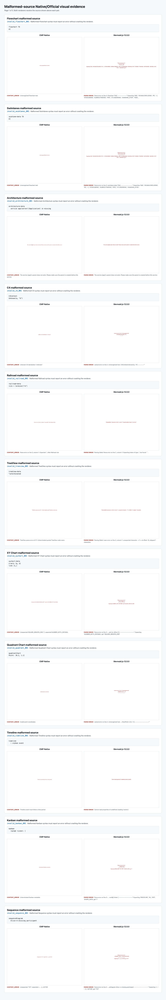
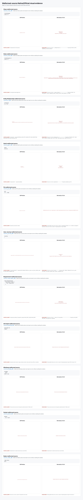
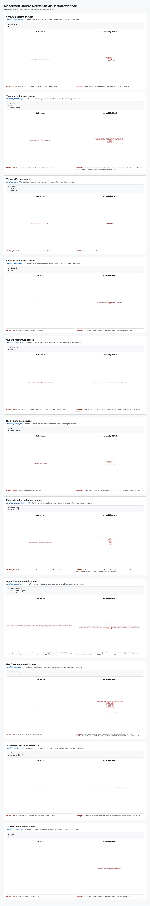

# Malformed-Source Native/Official Visual Evidence

This evidence contains 33 malformed Mermaid sources, one for every
supported diagram family, and 66 screenshots. Each source is sent
unchanged to CMP Native and Mermaid.js 12.0.0.

Passing means CMP Native returns `CONTENT_ERROR`, Mermaid.js displays a parse
or render error, both messages are non-empty, and neither page crashes or times
out. This is an error-state safety gate, not a pixel-similarity gate.

Case IDs, source hashes, screenshot hashes, capture sizes, and both error
messages are recorded in
[`invalid-source-manifest.json`](invalid-source-manifest.json).

