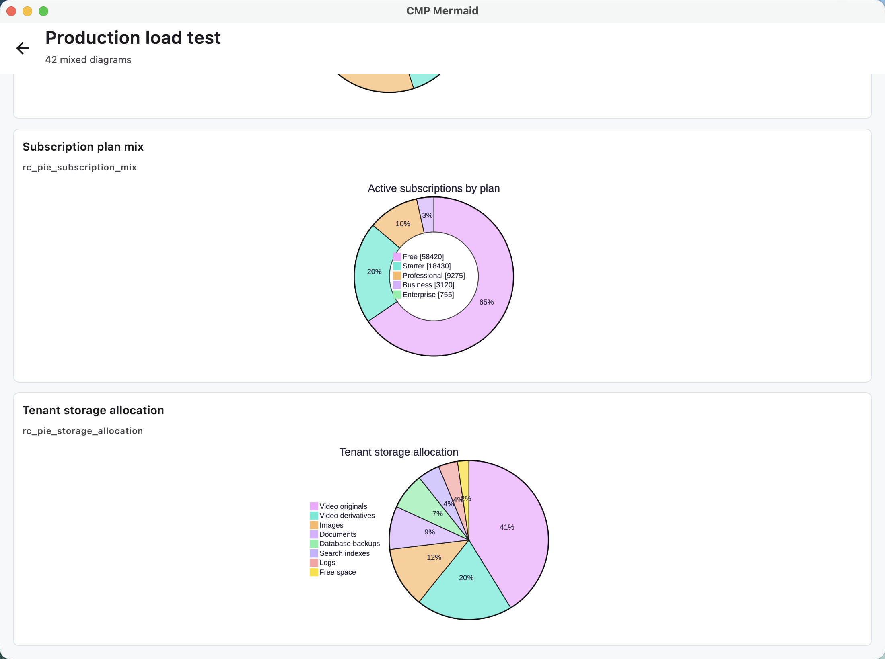

# Mermaid 12.0.0 Release Candidate Test Report

This report records the evidence behind CMP Mermaid's current
**Release Candidate** status. It is deliberately separate from the demo
gallery: every visual case below comes from an independent complex scenario
corpus that is not shown as a product demo.

## Decision

| Item | Result |
| --- | --- |
| Current rating | **Release Candidate** |
| Mermaid compatibility baseline | `12.0.0` |
| Independent complex scenarios | 42 |
| Native core render results | 42 passed, 0 failed |
| Web Native/Official captures | 84 generated, 0 render errors |
| Manual visual review | 42 acceptable, 0 blocked |
| Automated visual geometry | 42 passed, 0 failed |
| Deterministic SceneGraph replay | 42 passed, 0 mismatches |
| Deterministic generated stress inputs | 2,048 |
| JVM tests | 273 passed, 0 failed |
| Core production soak | 420 renders; 11.5s total; 101ms P95; 24KiB retained heap |
| Runtime load matrix | Android Emulator, iOS Simulator, Desktop, and Web passed |
| Platform build matrix | Android, Web, Desktop, iOS Arm64, iOS Simulator Arm64, iOS X64 passed |
| Android Internet permission | Not declared |

**Conclusion:** all eight supported diagram types now pass the independent
visual corpus, deterministic replay, generated stress tests, core soak, and
local runtime load matrix. The project remains a Release Candidate because the
final production gates are operational: the new visual CI job must be green on
`main`, and at least one real adopter must complete a guarded canary and rollback
exercise before the public status can be promoted to Stable.

## What This Report Does And Does Not Prove

This report proves that the exact source-controlled corpus:

- compiles through the Kotlin parser, database, layout, and SceneGraph pipeline;
- produces non-empty Native Canvas output;
- is accepted and rendered by the pinned Mermaid.js `12.0.0` reference;
- has been reviewed side by side at the same `1200 x 900` viewport;
- passes automated blank-image and severe content-geometry checks;
- can be regenerated from the repository scripts.

It does **not** prove that every possible legal Mermaid program is supported.
The automated image gate measures content bounds and foreground density, not
full semantic or pixel equality, so manual review remains required. Platform
font metrics and text wrapping may differ. The local runtime evidence is not a
substitute for telemetry from a real production integration.

## Independent Complex Corpus

The canonical corpus is
[`tools/official-reference/stability-corpus.mjs`](../tools/official-reference/stability-corpus.mjs).
Generated Kotlin copies are consumed independently by the core tests and the
Web audit screen. Case IDs use the `rc_` prefix and cannot be resolved through
the normal demo gallery.

| Diagram | Complex cases | Scenario examples | Manual visual result |
| --- | ---: | --- | --- |
| Flowchart | 6 | checkout compensation, regional failover, release rollback, incident response | Acceptable |
| XY Chart | 5 | latency percentiles, conversion, capacity, backlog, error budget | Acceptable |
| Sequence | 6 | checkout saga, OAuth race, multipart upload, retry delivery, offline sync | Acceptable; autonumber/activation layering rechecked |
| Class | 5 | commerce, workflow engine, authorization, notifications, editor model | Acceptable |
| State | 5 | fulfillment, payment, rollout, media processing, support lifecycle | Acceptable |
| Entity Relationship | 5 | commerce, learning, messaging, billing, warehouse inventory | Acceptable |
| Gantt | 5 | mobile release, database migration, regional launch, incident hardening | Acceptable |
| Pie | 5 | cloud cost, acquisition, incidents, subscriptions, storage | Acceptable |

`Acceptable` means the manual review found no missing domain entity, state,
message, series, relationship, or route that changes the meaning of the
diagram. It allows minor font, spacing, and edge-routing differences.

## Visual Evidence

Each contact sheet uses the same Mermaid source on both sides:

- left: CMP Native, rendered through Kotlin and Compose Canvas;
- right: Mermaid.js `12.0.0`, loaded from the repository's pinned local asset.

The source IDs and scenario descriptions are printed above every pair.

<details open>
<summary><strong>Flowchart: 6 complex scenarios</strong></summary>


</details>

<details open>
<summary><strong>XY Chart: 5 complex scenarios</strong></summary>


</details>

<details>
<summary><strong>Sequence: 6 complex scenarios</strong></summary>


The checkout saga was re-audited at full capture resolution. Sequence numbers
now use Mermaid `12.0.0` activation bounds, the official `6px` marker radius,
message-line clearance, and the upstream draw order that keeps number markers
above activation bars.

</details>

<details>
<summary><strong>Class: 5 complex scenarios</strong></summary>


</details>

<details>
<summary><strong>State: 5 complex scenarios</strong></summary>


</details>

<details>
<summary><strong>Entity Relationship: 5 complex scenarios</strong></summary>


</details>

<details open>
<summary><strong>Gantt: 5 complex scenarios</strong></summary>


The former width mismatch came from the debug Official iframe shrinking
Mermaid's temporary render container to `300px`, not from the Native timeline.
The comparison host now preserves the full iframe width and rejects a collapsed
Official Gantt viewBox. Multi-unit ticks also follow D3 `interval.every(count)`
epoch and calendar-field anchoring; the `2week` case now starts on the same
weeks as Mermaid.js.

</details>

<details>
<summary><strong>Pie: 5 complex scenarios</strong></summary>


</details>

The generated capture metadata, byte sizes, and SHA-256 values are available in
[`manifest.json`](assets/stability-report/manifest.json).

## Automated Test Evidence

The repository-level
[`Quality Gate`](../.github/workflows/quality.yml) repeats the JVM tests,
cross-platform builds, generated-corpus check, APK permission audit, 84-image
capture, visual geometry gate, and Web load test on every push to `main` and
every pull request.

The full verification command completed successfully:

```bash
JAVA_HOME=$(/usr/libexec/java_home -v 17) ./gradlew \
  :mermaid-core:jvmTest \
  :mermaid-compose:jvmTest \
  :sample:androidApp:assembleDebug \
  :sample:webApp:wasmJsBrowserDistribution \
  :sample:desktopApp:assemble \
  :mermaid-core:compileKotlinIosArm64 \
  :mermaid-core:compileKotlinIosSimulatorArm64 \
  :mermaid-core:compileKotlinIosX64 \
  :mermaid-compose:compileKotlinIosArm64 \
  :mermaid-compose:compileKotlinIosSimulatorArm64 \
  :mermaid-compose:compileKotlinIosX64 \
  :mermaid-debug-ui:compileKotlinIosArm64 \
  :mermaid-debug-ui:compileKotlinIosSimulatorArm64 \
  :mermaid-debug-ui:compileKotlinIosX64
```

Result:

```text
BUILD SUCCESSFUL
mermaid-core: 256 tests
mermaid-compose: 17 tests
total: 273 tests
failures: 0
errors: 0
```

The independent corpus test is
[`StabilityCorpusTest`](../mermaid-core/src/commonTest/kotlin/io/github/cmpmermaid/core/StabilityCorpusTest.kt).
It compiles all 42 sources and rejects parser errors, invalid scene dimensions,
or empty SceneGraphs.

The existing deterministic stress suites generate 256 inputs for each of the
eight diagram types, for 2,048 generated inputs in total. Flowchart exercises
both Dagre and ELK for every generated source.

## Determinism And Performance Evidence

Every one of the 42 independent scenarios is rendered twice and compared as a
complete `MermaidScene`, including dimensions, elements, paths, text, styles,
metadata, and z-order.

The JVM production soak performs two warmup rounds followed by 10 measured
rounds over all 42 scenarios:

```text
renders=420
totalMs=11514
p95Ms=101
retainedHeapBytes=24112
```

Enforced budgets are 30 seconds total, 500ms P95, and 64MiB retained heap after
forced GC.

## Runtime Load Matrix

The shared load screen renders the 42 mixed scenarios in a `LazyColumn` and
walks from the first Flowchart to the final Pie chart.

| Platform | Result | Local evidence |
| --- | --- | --- |
| Android Emulator | Passed | 8s scroll; 216MiB peak PSS; 180MiB final PSS; final case reached |
| iOS Simulator | Passed | Five fresh-process traversals; about 473-491MiB final RSS; no new crash report |
| Desktop | Passed | Final case reached; about 454MiB process RSS; about 59MiB JVM heap used |
| Web | Passed | 928ms first content; 2.67s scroll; 5.4MiB retained JS heap; no browser errors |

All four screenshots show the final corpus case after traversing the same mixed
list:

| Android Emulator | iOS Simulator |
| :---: | :---: |
|  |  |

| Desktop | Web |
| :---: | :---: |
|  |  |

The iOS run also identified and fixed a real concurrency defect: concurrent
background renders were mutating Compose/Skia's font provider from multiple
default-queue threads and could crash with `EXC_BAD_ACCESS`. The Apple Compose
render path now serializes text measurement and rendering on
`Dispatchers.Main.immediate`; Android, Desktop, and Web retain
`Dispatchers.Default`.

## APK Permission Audit

Audited artifact:

```text
sample/androidApp/build/outputs/apk/debug/androidApp-debug.apk
```

Declared permissions:

```text
io.github.cmpmermaid.sample.DYNAMIC_RECEIVER_NOT_EXPORTED_PERMISSION
```

`android.permission.INTERNET` is not declared.

## Reproduce The Report

```bash
cd tools/official-reference
npm run generate:stability-corpus

cd ../..
JAVA_HOME=$(/usr/libexec/java_home -v 17) \
  ./gradlew :mermaid-core:jvmTest :sample:webApp:wasmJsBrowserDistribution

python3 -m http.server 8093 \
  --directory sample/webApp/build/dist/wasmJs/productionExecutable \
  >/tmp/cmp-mermaid-web.log 2>&1 &
WEB_SERVER_PID=$!
trap 'kill "$WEB_SERVER_PID"' EXIT

cd tools/official-reference
AUDIT_SOURCE=stability \
OUTPUT_DIR=captures/local/rc-stability-corpus \
BASE_URL=http://127.0.0.1:8093/ \
VIEWPORT_WIDTH=1200 \
VIEWPORT_HEIGHT=900 \
npm run capture:web-audit

INPUT_DIR=captures/local/rc-stability-corpus \
OUTPUT_FILE=captures/local/stability-geometry.json \
npm run audit:stability-geometry

BASE_URL=http://127.0.0.1:8093/ \
OUTPUT_DIR=captures/local/load-test-web \
npm run test:web-load

npm run generate:stability-contact-sheets
```

The capture command fails if a requested Native canvas or Official SVG does not
appear, if Mermaid reports an error, if an Official Gantt viewBox collapses, or
if a screenshot is below the minimum size. The geometry gate rejects blank
images and severe width, height, or foreground-density differences. The
contact-sheet generator verifies every expected pair and records its SHA-256.

## Promotion Gate For Stable

The project should only restore the Stable label when all of these are true:

- the independent complex corpus has no blocked visual category;
- Native/Official comparison includes automated semantic or perceptual
  thresholds with reviewed exceptions;
- the Quality Gate workflow is required and green on `main`;
- Android, Web, iOS, and Desktop have runtime smoke evidence, not compile-only
  evidence;
- bulk rendering has repeatable memory, latency, and long-running soak limits;
- no open high-severity correctness defect exists for the supported contract;
- a Release Candidate has been exercised by at least one real integration.

The repository-local technical gates now pass. The remote visual job and a real
integration canary remain outstanding, so the public status stays
**Release Candidate**.
